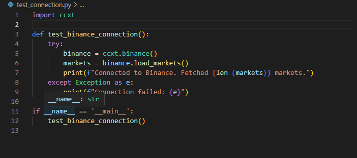
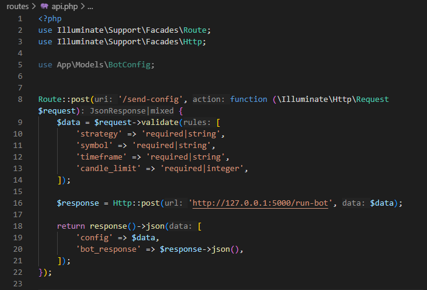
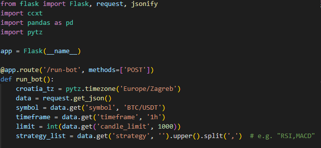
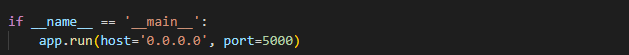
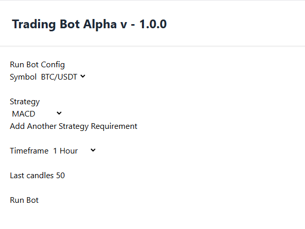
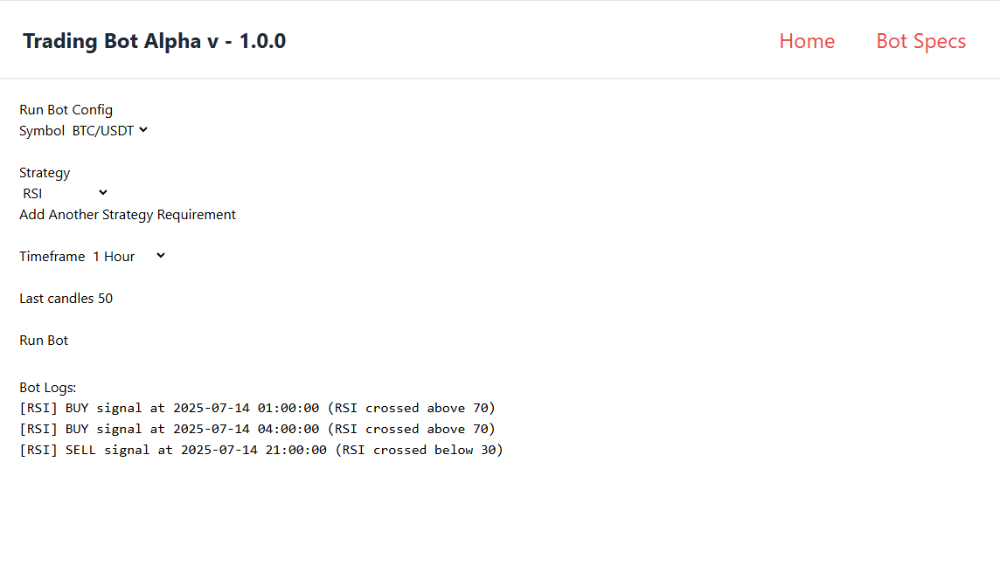

# Python Trading Bot

Trading bot that analyses markets historical data in seconds on Binance Crypto Excange.

---

## 🛠 Features(some in progress)

- User panel for entering data and desired indicator values that trigger bot to alert the user
- Symbol/Cryptocurrency selection
- Trading timeframe selection
- Limit historical candles backtest (if selected timeframe is 1H, and candle amount is 50, last 50 market hours will be returned)
- Strategy builder (work in progress)

---

### 👤 Binance API Connection

In order to recieve market data, connection with Binance API has to be made

---

### 👤 Python-Laravel UI Connection

In order for user to be able to communicate to pyton flask server, following connection has to be made

In Laravel we do a route

Followed by the recieving end on python flask server

---

### 🧑‍💼 User Panel - Strategy Builder

User enters input;

What cryptop coin to trade, on which timeframe and how many candles to backtest for a desired strategy.

---

### 🕒 Run Bot

In this instance, bot ran last 50 hours and traded instances where RSI indicator was either above 70 or below 30.
As it does that, it logs it's actions

---

